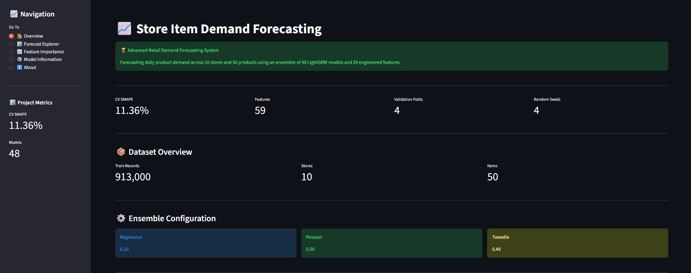
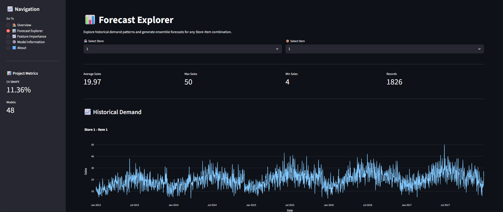
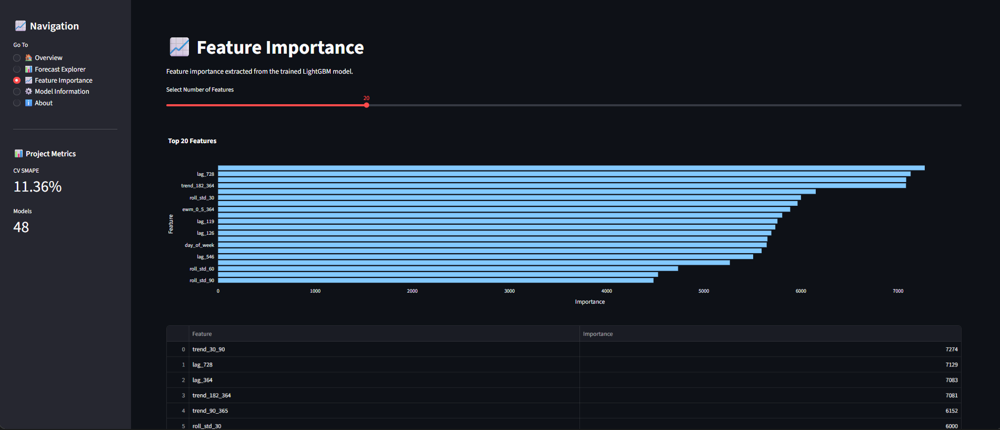

# 📈 Store Item Demand Forecasting

An advanced retail demand forecasting system built using ensemble machine learning and time-series forecasting techniques.

The project predicts future product demand across multiple stores by leveraging historical sales patterns, seasonality, trend signals, lag features, rolling statistics, and exponential weighted averages.

---

## Dashboard Overview



## Forecast Explorer



## Feature Importance



---

## 🚀 Project Highlights

* Advanced Time-Series Forecasting Pipeline
* 59 Engineered Features
* Multi-Fold Time-Based Validation
* Multi-Seed Training Strategy
* LightGBM Ensemble Architecture
* SHAP Explainability
* Interactive Streamlit Dashboard
* Production-Ready Deployment

---

## 🏆 Model Performance

| Metric           | Value  |
| ---------------- | ------ |
| CV SMAPE         | 11.36% |
| Features         | 59     |
| Validation Folds | 4      |
| Random Seeds     | 4      |
| Total Models     | 48     |

---

## 🧠 Forecasting Models

The final forecasting system combines three different LightGBM objectives:

* LightGBM Regression
* LightGBM Poisson
* LightGBM Tweedie

The final prediction is generated using optimized ensemble weights:

| Model      | Weight |
| ---------- | ------ |
| Regression | 0.10   |
| Poisson    | 0.50   |
| Tweedie    | 0.40   |

---

## ⚙️ Feature Engineering

The project includes multiple feature groups:

### Calendar Features

* Year
* Month
* Day
* Day of Week
* Quarter
* Week of Year
* Weekend Indicators

### Cyclic Features

* Month Sine/Cosine Encoding
* Day-of-Week Sine/Cosine Encoding

### Lag Features

* 91-Day Lag
* 98-Day Lag
* 105-Day Lag
* 112-Day Lag
* 119-Day Lag
* 126-Day Lag
* 182-Day Lag
* 364-Day Lag
* 546-Day Lag
* 728-Day Lag

### Rolling Statistics

* Rolling Means
* Rolling Standard Deviations

### EWMA Features

* Multiple Alpha Configurations
* Multiple Historical Windows

### Trend Features

* Short-Term Trend
* Medium-Term Trend
* Long-Term Trend

### Aggregation Features

* Store-Level Statistics
* Item-Level Statistics
* Store-Item Statistics

---

## 📊 Exploratory Data Analysis

Key findings:

* Strong yearly seasonality
* Clear monthly demand patterns
* Significant weekday effects
* Store-specific demand behavior
* Product-specific demand behavior

---

## 📈 Streamlit Dashboard

The deployed application includes:

### 🏠 Overview

* Project KPIs
* Ensemble Configuration
* Forecast Statistics
* Submission Download

### 📊 Forecast Explorer

* Historical Demand Analysis
* Monthly Seasonality
* Weekly Patterns
* Ensemble Prediction Demo

### 📈 Feature Importance

* Interactive Feature Ranking
* Dynamic Feature Selection

### ⚙️ Model Information

* Validation Strategy
* Training Configuration
* Ensemble Architecture

### ℹ️ About

* Project Overview
* Dataset Information
* Forecasting Approach

---

## 🗂️ Project Structure

```text
Store-Item-Demand-Forecasting/
│
├── app/
│   └── app.py                        
│
├── artifacts/
│   ├── ensemble_config.pkl           
│   ├── features.pkl                  
│   ├── log_models.pkl               
│   ├── poisson_models.pkl           
│   └── tweedie_models.pkl            
│
├── assets/
│   ├── overview.png
│   ├── forecast.png
│   └── importance.png
│
├── Data/
│   ├── train.csv
│   └── test.csv
│
├── Notebook/
│   └── Store-Item-Demand-Forecasting.ipynb
│
├── output/
│   ├── feature_importance.csv
│   └── submission.csv
│
├── requirements.txt
└── README.md
```

---

## 💻 Installation

```bash
git clone <your-repository-url>

cd Store-Item-Demand-Forecasting

pip install -r requirements.txt
```

---

## ▶️ Run Streamlit App

```bash
cd app

streamlit run app.py
```

---

## 🛠️ Tech Stack

* Python
* Pandas
* NumPy
* LightGBM
* Scikit-Learn
* SHAP
* Plotly
* Streamlit

---

## 📌 Future Improvements

* Recursive Multi-Step Forecasting
* Automated Feature Builder
* Real-Time Forecast Generation
* Cloud Model Serving
* MLOps Pipeline Integration

---

## 👤 Author

Built as an advanced end-to-end machine learning and time-series forecasting portfolio project covering:

* Business Understanding
* Data Analysis
* Feature Engineering
* Model Development
* Explainability
* Deployment
